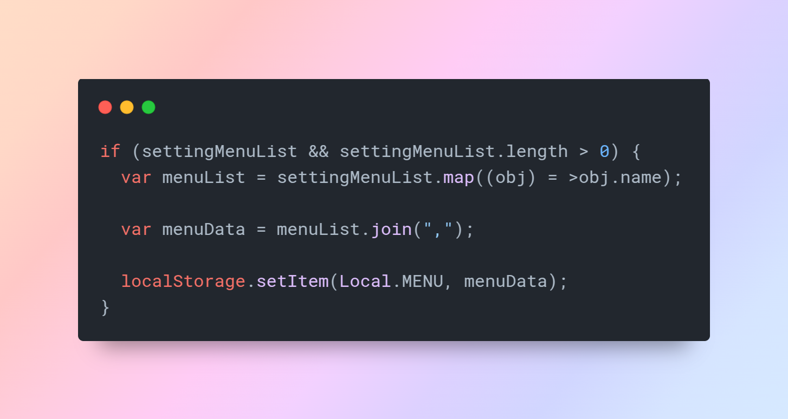
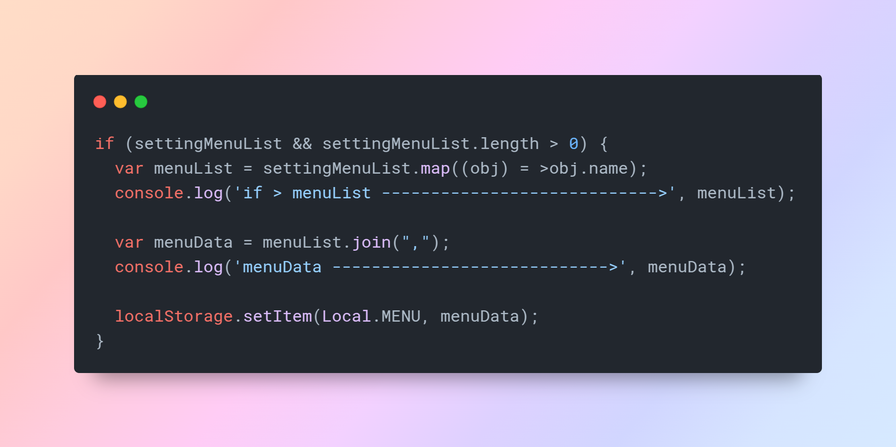

# Auto Console Log By Vallarasu Kanthasamy

  
  
Vallarasu Kanthasamy

<!-- --- -->

<!--  -->

> Automatically add `console.log()` statements for all variables in your file with just one shortcut.  
> Debug like a ninja ⚡ No manual effort. No wasted seconds.

<!-- --- -->

## 🎯 Key Feature Highlight

💥 Press <code>Ctrl + Shift + L</code> to instantly console.log ALL your variables in the file.  
No typing, no missing logs — just <strong>supercharged debugging</strong> ⚡

<!-- --- -->

<h1 align="center" style="margin: 1%;">🖼️ Before & After – See the Magic</h1>

  
  
  

<blockquote>See the transformation — instantly!</blockquote>

## ⚙️ How to Use

Just hit the shortcut and BOOM 💥 — all variables in your file are automatically logged.

| OS                 | Shortcut                          |
| ------------------ | --------------------------------- |
| 🪟 Windows/Linux   | `Ctrl + Shift + L`                |
| 🍎 macOS           | `Cmd + Shift + L`                 |
| 🧭 Command Palette | `Ctrl+Shift+P → Add Console Logs` |

---

## 📦 Installation

1. Open **Extensions** in VS Code (`Ctrl + Shift + X`)
2. Search: `Auto Console Log By Vallarasu Kanthasamy`
3. Click **Install**
4. Done! 🎉

Or install from the [Marketplace →](https://marketplace.visualstudio.com/items?itemName=VallarasuKanthasamy.auto-console-log-by-vallarasu-kanthasamy)

---

## ✅ What It Logs

- All `let`, `const`, and `var` variables in the current file
- Files supported: `.js`, `.ts`, `.jsx`, `.tsx`
- Format: `console.log("name:", name);`

---

## 🧪 Comparison Table

| Feature              | Turbo Console Log ❄️        | Auto Console Log 🔥 (Yours) |
| -------------------- | --------------------------- | --------------------------- |
| Logging Method       | One by one manually         | All at once automatically   |
| Productivity Boost   | 🐢 Medium                   | ⚡ High                     |
| Output Style         | `console.log('var:', var);` | `console.log("var:", var);` |
| Supported File Types | JS / TS / React             | JS / TS / React             |

---

## 🔥 Features Recap

✅ One-shot shortcut logging  
✅ Custom log levels (`log`, `info`, `warn`, `error`)  
✅ Supports `.js`, `.ts`, `.jsx`, `.tsx`  
✅ Lightning-fast debugging for real projects

---

## 👨‍💻 About the Developer

> Hey there! I'm **Vallarasu Kanthasamy**, a React Developer from Bangalore 🚀  
> I love building smart tools that help developers save time and stay productive.

**Tech Stack**

- ⚛️ React, React Native, Node.js, Express.js
- 🌐 WordPress Plugin & Theme Development
- 🧰 Productivity Automation Tools

**Projects**

- ✅ [ATS Resume Maker](https://atsresumemaker.vallarasuk.com)
- 📚 [Developer PDF Resource Hub (850+ PDFs)](https://www.vallarasuk.com/resources)
- 🎥 [Daily Focus Reels](https://www.instagram.com/daily_focus_track/reels/)
- 📄 [vallarasuk.com](https://www.vallarasuk.com)

---

## 🌐 Connect with Me

- 🔗 [Website](https://www.vallarasuk.com)
- 💼 [LinkedIn](https://linkedin.com/in/vallarasu-kanthasamy)
- 📂 [GitHub](https://github.com/vallarasuk)
- 📬 [Join WhatsApp Community](https://chat.whatsapp.com/JzCFT47gI6aE8O6mJA96V0)

---

## 🤝 Contributing

Pull requests and suggestions are welcome!  
Fork this repo and create an issue to suggest features or improvements.

---

## ❓ FAQ

  
Does it work with React?

  
Absolutely! It works perfectly with `.js`, `.ts`, `.jsx`, and `.tsx` files.

  
Can I change log type?

  
Yes — choose between <code>log</code>, <code>info</code>, <code>warn</code>, and <code>error</code>.

  
Is this better than Turbo Console Log?

  
Yes! This tool logs all variables at once, saving more time than Turbo Console Log, which logs only one variable at a time.

---

## 🚀 Start Debugging Smarter Now

  <h2 style="color:#ff6f61;">🚀 Install & Slash Debug Time</h2>
  
Automate logging and focus on solving problems — not typing logs.

  

